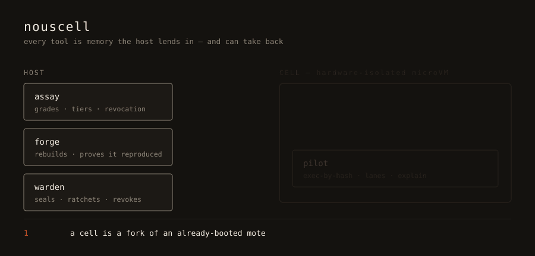

<p>
  <picture>
    <source media="(prefers-color-scheme: dark)" srcset="docs/assets/celln-lockup-dark.svg">
    
  </picture>
</p>

**Celln** runs agents in isolated **cells** that borrow verified tools instead
of rebuilding Linux environments.

```console
$ celln agent --tool python "decode this base64 and name the file type: R0lGODlhAQABAAAAACw="
  ✔ /usr/bin/python permitted in the agent lane
GIF image
```

A model wrote that code. An attested python ran it, on input you have no reason
to trust, in a cell with no network and nothing writable but `/tmp` — then the
cell dissolved.

Read the second line again. It says **agent** lane, and you never had to ask
for it. python is fully attested and keeps its hash, but code a model wrote is
agent-authored input, and handing that to a tool marked `interpreter = true`
demotes the invocation. Authority is decided per call, not per binary.

<p align="center">
  
</p>

## How is this different?

Most agent runtimes give an agent a machine. Celln gives it a temporary,
read-only lease on the tools it needs.

[Read the documentation →](https://sympozium-ai.github.io/celln/) ·
[Guided tutorial →](https://sympozium-ai.github.io/celln/tutorial.html)

> *Software is a service the host provides to the process, not property the
> machine owns.*

## Install

```sh
brew install sympozium-ai/celln/celln
```

Homebrew names the `sympozium-ai/homebrew-celln` repository as the
`sympozium-ai/celln` tap. The tap and source repository are public. On Linux,
the formula downloads the static release archive; it does not build Celln with
Rust locally.

To run cells on Linux, install the guest-image tools first:

```sh
# Fedora/RHEL
sudo dnf install gcc cpio e2fsprogs

# Debian/Ubuntu
sudo apt install build-essential cpio e2fsprogs
```

Release archives target Linux x86_64; Celln does not publish an ARM64 archive
while its KVM backend is x86-specific.

<details>
<summary>or from source</summary>

```sh
git clone https://github.com/sympozium-ai/celln.git
cd celln
rustup target add x86_64-unknown-linux-musl # static guest-pilot target
cargo build --release -p celln-cli
./target/release/celln doctor
```
</details>

Running cells needs Linux with `/dev/kvm`, `gcc`, `cpio`, and `e2fsprogs`.
Everywhere else `celln` still validates specs and runs `celln demo`, and
`celln doctor` reports each prerequisite and its remedy.

## Use it

```sh
celln doctor
celln setup
celln image spec python > agent.toml
celln spec check agent.toml
celln run agent.toml
celln verify
```

`celln image spec` creates the policy file; `celln run` seals and runs it.
For a task-driven spec, put the provider prompt in `[agent].task` or pass it
with `celln run agent.toml --task "…"`. Use `[run]` instead when you want to
pin exact arguments with no provider involved.

The [tutorial](https://sympozium-ai.github.io/celln/tutorial.html) is the
worked path. The [CLI reference](https://sympozium-ai.github.io/celln/cli.html)
lists the commands, and the [tool-lane guide](https://sympozium-ai.github.io/celln/tool-lane.html)
explains tool images, specs, tiers, and multi-tool cells.

## A model writes code, a cell runs it

A cell exists to contain code you would rather not run unsealed.
`--show-source` prints what the model wrote.

Name a catalogue tool and describe the work:

```sh
celln agent --tool python "decode this base64 and name the file type"
celln agent --tool curl "print the installed curl and TLS versions"
```

For an interpreter, the provider writes a program; for another tool, it writes
the arguments. An interpreter consuming provider-written code runs in the
agent lane. A non-interpreter invocation remains in the tool lane, so Celln
warns when provider-authored arguments would retain that authority.

> A cell has no network stack. `curl` cannot fetch a URL; declare an
> `allow_hosts` entry and use the brokered `builtin = "fetch"` capability instead.

**For repeatable or reviewed runs, use a spec.** Scaffold one from the
catalogue — it comes ready with an `[agent]` block, so the task is declared
alongside the policy:

```sh
$ celln image add curlimages/curl:8.21.0   # once; skip if already materialised
$ celln image spec curl > cell.toml
```

`cell.toml` arrives like this; fill in the task and run it:

```toml
name = "curl"

[cell]
memory = "512MiB"

[[tool]]
alias = "/usr/bin/curl"
image = "curl"
exec  = "/usr/bin/curl"

# Let a model write what to run — fill in the task, then `celln run`.
[agent]
exec = "/usr/bin/curl"
task = "print the installed curl and TLS versions"
```

The scaffold is the same shape for every tool: `celln image spec python` also
produces an `[agent]` block, differing only in which alias it names. The
`task` is the agent prompt. It can live in the spec, as above, or be supplied
per run — omit `task` from the file and use:

```sh
celln run cell.toml --task "print the installed curl and TLS versions"
```

`[run]` is the alternative for a pinned, model-free invocation; use it instead
of `[agent]`, never alongside it:

```toml
[run]
exec = "/usr/bin/curl"
args = ["--version"]
```

Without `--tool`, the provider writes Rust and Celln forges a static binary.
It still runs in the agent lane: compiling model-written source never promotes
it to tool authority. See the [agent-lane guide](https://sympozium-ai.github.io/celln/agent-lane.html)
for the full flow, provider setup, and brokered egress.

## Execution lanes

- **Tool lane**: host-provided, attested tools use only the authority the cell loans them.
- **Agent lane**: agent-authored code gets only explicitly loaned capabilities: its executable and workspace by default, with no network.
- **Data**: bytes the agent produced or fetched. Data never gains authority by being handed to an attested tool.

An attested interpreter fed an agent-written script runs in the **agent lane**;
it does not inherit tool-lane authority.

The [concepts](https://sympozium-ai.github.io/celln/concepts.html) series
explains the lanes, reproducibility tiers, provider configuration, and the
network boundary in detail.

## Output

Human-readable on a terminal, NDJSON the moment it is not. No flag needed,
though `--json` and `--no-json` force it either way.

```sh
celln run agent.toml | jq -r 'select(.event=="tool_resolved") | "\(.alias) \(.tier)"'
celln ps -a --json | jq -r "select(.status==\"failed\") | .id"
celln doctor --json | jq -e '.can_seal_cells // empty' >/dev/null && echo "can seal"
```

Diagnostics go to stderr, so they never land in the data. Exit codes mean
something: `0` ok · `1` error · `2` spec invalid · `3` host cannot seal cells ·
`4` refused by the trust model · `5` unsupported.

## Isolation and limits

Based on our hardware tests, `celln run` seals a microVM and lends tools as
read-only memory that the guest cannot modify. `celln verify` runs a guest that
enters protected mode and maps a sealed page writable in page tables it wrote.
The test also checks revocation in an already-running cell.

`celln agent` runs agent-authored programs behind a Landlock filesystem boundary
and a seccomp syscall filter.
The guest may execute `/tools/program` and write only to `/celln/work`; network,
mounting, tracing, and privilege gain are refused. `celln run` remains the
spec-driven sealing path.

Run `celln verify` and `make bench-kvm` on a KVM host to reproduce the hardware
checks and measurements.

## Reading

The full set is published at [sympozium-ai.github.io/celln](https://sympozium-ai.github.io/celln/).

| Topic | Where | Covers |
|---|---|---|
| Start here | [Start here](https://sympozium-ai.github.io/celln/start.html) | Five commands, about five minutes: install, connect an agent, then `doctor` / `spec` / `run` / `verify` / `agent` in order. |
| Command reference | [CLI](https://sympozium-ai.github.io/celln/cli.html) | The commands most people need, grouped: daily use, asking an agent, running declared tools, inspecting a run. |
| Tutorial | [Tutorial](https://sympozium-ai.github.io/celln/tutorial.html) | Three worked cells, each teaching one idea; plus adding your own tool. |
| Concepts hub | [Concepts](https://sympozium-ai.github.io/celln/concepts.html) | The four-page series below, as one entry point. |
| The model | [Model](https://sympozium-ai.github.io/celln/model.html) | Mote, cell, assay, warden, pilot — the vocabulary and one cell's lifecycle. |
| Tool lane | [Tool lane](https://sympozium-ai.github.io/celln/tool-lane.html) | `celln spec` / `celln run`: declaring a tool, closures and images, tiers, the interpreter flag. |
| Agent lane | [Agent lane](https://sympozium-ai.github.io/celln/agent-lane.html) | `celln agent` walkthrough: forging, attestation, choosing a backend, brokered egress. |
| Security boundary | [Security](https://sympozium-ai.github.io/celln/security.html) | What's hardware-enforced, what's brokered, and what Celln does not claim. |
| Vocabulary | [Model: five terms](https://sympozium-ai.github.io/celln/model.html#terms) | Mote, cell, assay, warden, and pilot. |
| Run the hardware checks | `celln verify` and `make bench-kvm` | Reproduce the isolation proofs and spawn-latency measurements on your own KVM host. |
| Working on Celln itself | [AGENTS.md](AGENTS.md), then `make help` | Contributor setup, the Makefile targets, what CI runs. |

Pre-alpha, single-host. Name pending formal trademark/domain clearance.
